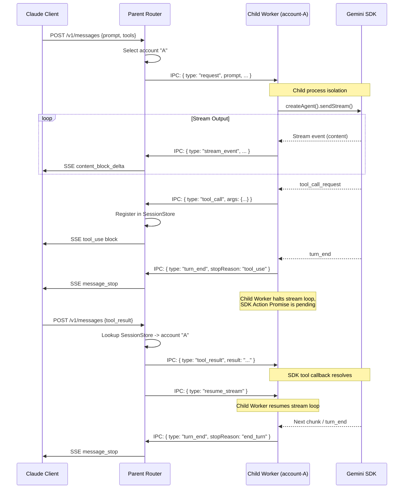

# System Architecture

## Overview

Claude2Gemini-CLI is a translation proxy that bridges two fundamentally different API paradigms:

- **Claude Messages API** — Stateless, request/response model. Every HTTP request contains the full conversation history.
- **Gemini CLI SDK** — Stateful agent loop. A single `sendStream()` call runs an internal loop that automatically handles tool execution via callbacks.

Historically, the proxy ran the Gemini CLI SDK in-process. However, the SDK uses a global module-level cache for authentication clients. To safely support multiple accounts operating concurrently, the proxy now uses a **Parent/Child Process Isolation** architecture.

---

## Component Architecture

```mermaid
flowchart TD
    subgraph Parent Process (Express Server)
        A[POST /v1/messages] --> B[messages.ts]
        B -->|Round-Robin| C[AccountPool]
        B -->|Session Routing| D[SessionStore]
        B --> E[ChildManager]
        E -->|UNIX Socket| F[IPC stream / SSE conversion]
    end

    subgraph Child Processes (Node.js Workers)
        G[ChildWorker Account A]
        H[ChildWorker Account B]
        
        G -.->|SDK instance| G1[GeminiCliAgent]
        H -.->|SDK instance| H1[GeminiCliAgent]
    end
    
    E == NDJSON IPC ==> G
    E == NDJSON IPC ==> H
    G1 -.->|Network| I[Google Gemini API]
    H1 -.->|Network| I
```

---

## File-by-File Description

### `server/index.ts`

Express application entry point. Configures JSON body parsing (200MB limit for large conversation histories), registers the `/v1/messages` route, and initializes the `accountPool` and `childManager` upon startup.

### `server/child-manager.ts`

Manages the lifecycle of child worker processes.
- Spawns a dedicated Node.js child process (`child-worker.ts`) for each configured account.
- Connects to each worker via UNIX Domain Sockets.
- Handles message routing (Parent ↔ Child) and auto-restarts workers if they crash.

### `server/child-worker.ts`

The isolated execution boundary for the Gemini CLI SDK.
- Restricts `process.env.GEMINI_CLI_HOME` to a specific temporary account directory.
- Runs a UNIX socket server to receive instructions (NDJSON) from the Parent process.
- Instantiates `GeminiCliAgent`, executes SDK flows, and intercepts `ServerGeminiStreamEvent`.
- Forwards output chunks, tool requests, and errors back to the Parent process.

### `server/ipc-protocol.ts`

Defines TypeScript interfaces for NDJSON communication between Parent and Child processes.
- **ParentMessage**: `request`, `tool_result`, `resume_stream`
- **ChildMessage**: `stream_event`, `tool_call`, `turn_end`, `error`, `fatal_error`, `ready`

### `server/routes/messages.ts`

The core request handler for `POST /v1/messages`. Responsibilities:
1. **Request validation** — Checks `messages`, `max_tokens`, and `model` fields
2. **Tool result routing** — Inspects the last message for `tool_result` blocks. Lookups pending tool calls in `SessionStore` and forwards results via `ChildManager`.
3. **Session resume** — Sends a `resume_stream` IPC message to instruct the Child Worker to continue consumption of an active SDK stream.
4. **Response dispatch** — Consumes `ChildMessage` streams and routes to formatting functions.
5. **Error handling** — Returns Claude-compatible error responses.

### `server/session-store.ts`

Lightweight state management for the Parent process:
- Directs clients back to the correct child worker by maintaining a map of `sessionId → accountId`.
- Resolves stateless tool results to their original sessions via a reverse index: `toolCallId → sessionId`.

### `server/converters/request.ts`

Converts Claude message arrays into Gemini prompt strings:
- **Role-labeled conversation text** (`User: ...`, `Assistant: ...`)
- **Tool blocks** → Text representations (`[Tool Call: ...]`)
- **Model name mapping** — Converts Claude model names to Gemini equivalents (e.g. sonnet → `gemini-2.0-flash`)

### `server/converters/stream.ts`

Transforms NDJSON IPC events emitted by `ChildWorker` into standard Claude SSE events in real-time:

```
IPC Event (ChildMessage)             Claude SSE Event Flow
────────────────────────             ─────────────────────
                                     event: message_start
stream_event (content)   ──────►     event: content_block_start (text)
                                     event: content_block_delta (text_delta)
                                     event: content_block_stop

tool_call                ──────►     event: content_block_start (tool_use)
                                     event: content_block_delta (input_json_delta)
                                     event: content_block_stop

turn_end                 ──────►     event: message_delta (stop_reason)
                                     event: message_stop
```

To combat race conditions, `stream.ts` implements a buffer layer within `getSessionStream` that caches IPC messages arriving before the Parent has initiated `await new Promise(...)` pulling loops.

---

## Core Design: Tool Use and Process Bridging

The most challenging aspect of this proxy is bridging the synchronous Claude tool paradigm with the stateful, callback-based SDK across a process boundary.

### Execution Flow



### Multi-Account Concurrency & Isolation

- **Bypassing Global Caches**: The Gemini CLI SDK uses file-system global config reads and cache modules per Node.js memory space. Previously, the proxy attempted to isolate these using an `AsyncLocalStorage` proxy over `process.env`.
- **Absolute Process Separation**: Currently, every account gets its own fully-isolated Node.js `fork()`, ensuring the global Node.js module cache is 100% safe.
- **Resilience**: If a Child Worker encounters an unexpected error or exits, `ChildManager` immediately reconstructs it, preventing process-level corruption from bleeding into other active accounts.

---

## Limitations

- **No image/file content** — Only text content blocks are supported
- **No conversation caching** — Gemini SDK manages its own conversation state; multi-turn history is flattened into prompt text
- **In-memory sessions** — Parent sessions and Child streams are lost on proxy restart
- **Single-node** — Designed for single-server execution; multiple proxies would require external session orchestration (e.g. Redis).
