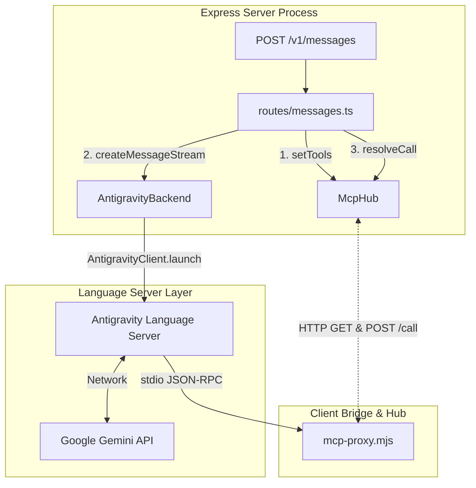
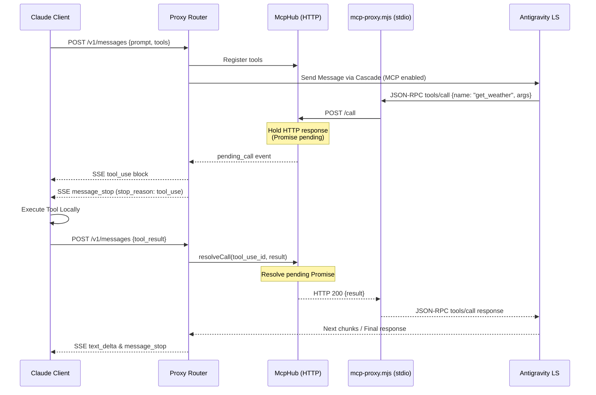

# System Architecture

## Overview

Claude2Gemini-CLI is a translation proxy that bridges two fundamentally different API paradigms:

- **Claude Messages API** — Stateless, request/response model. Every HTTP request contains the full conversation history.
- **Antigravity Language Server (LS) / Cascades** — Stateful agent loop managed via Connect gRPC. A Cascade runs an internal agent loop that invokes tools.

Historically, the proxy ran the Gemini CLI SDK in-process via multiple child processes. The architecture has since been simplified to a **Single-Process** design. The proxy now directly interfaces with the **Antigravity Language Server** (a Go-based subprocess managed by `antigravity-client`) and delegates tool execution back to the external client using an **MCP Proxy & Hub** mechanism.

---

## Component Architecture


```mermaid
flowchart TD
    subgraph Express_Server ["Express Server Process"]
        A[POST /v1/messages] --> B["routes/messages.ts"]
        B -->|1. setTools| C[McpHub]
        B -->|2. createMessageStream| D[AntigravityBackend]
    end

    subgraph Client_Bridge ["Client Bridge & Hub"]
        C <.->|HTTP GET & POST /call| F[mcp-proxy.mjs]
        B -->|3. resolveCall| C
    end

    subgraph LS_Layer ["Language Server Layer"]
        D -->|AntigravityClient.launch| E[Antigravity Language Server]
        E -->|stdio JSON-RPC| F
        E <-->|Network| G[Google Gemini API]
    end
```

---

## File-by-File Description

### `server/index.ts`

Express application entry point. Configures JSON body parsing (200MB limit for large conversation histories), registers the `/v1/messages` route, and initializes the `AntigravityBackend` upon startup.

### `server/gemini-backend.ts`

Manages the lifecycle of the Antigravity Language Server (LS) and provides the interface for sending prompts and handling Cascades.
- Starts the `McpHub` HTTP server before launching the LS.
- Launches the actual Antigravity Language Server via `AntigravityClient.launch`.
- Writes `.mcp.json` to its temp workspaceDir (under `/tmp`) and registers the proxy server on startup using the LS `refreshMcpServers` RPC. The `/tmp` location keeps Claude Code from auto-discovering the proxy as an MCP server.
- Converts request tools via `McpHub.setTools` and schedules the first synchronization check.
- Extracts the latest `user` message as the main prompt, merging subsequent contexts (like Git statuses or custom system hooks) at the beginning of the message stream inside `=== SYSTEM CONTEXT ===` block tags.

### `server/mcp-hub.ts`

An internal, lightweight HTTP server that acts as a bridge between the external client (which provides tool definitions and executes them) and the LS.
- **`GET /tools`**: Exposes registered tools formatted in the MCP `tools/list` schema.
- **`POST /call`**: Receives tool execution requests from the LS (via `mcp-proxy.mjs`). It **holds the HTTP response** (blocks via Promise) until the client provides the result.
- **`POST /resolve`**: Receives the execution results from the external client and resolves the blocked `/call` request.

### `server/mcp-proxy.mjs`

A Node.js script spawned directly as a subprocess of the Antigravity Language Server.
- Acts as a stdio-to-HTTP translator, communicating with the LS via line-delimited JSON-RPC (stdio) and forwarding requests to `McpHub` (HTTP).
- Handles the MCP `initialize` handshake, `tools/list` routing, and `tools/call` routing.
- Runs an internal 1-second polling timer checking `/tools` of `McpHub` for updates. If a modification is detected, it pushes a `notifications/tools/list_changed` JSON-RPC notification to the LS, triggering a tool re-sync without restarting the process.

### `server/routes/messages.ts`

The core request handler for `POST /v1/messages`.
- Maps incoming model names (e.g. `sonnet` or `opus`) to corresponding Gemini equivalents.
- Intercepts incoming messages for `tool_result` blocks. If present, it resolves the pending call in `McpHub` via `resolveCall`, allowing the blocked Cascade step to proceed.
- Consumes the `AntigravityBackend.createMessageStream` stream and converts events into Claude-compatible SSE events in real-time.

### `server/session-store.ts`

Tracks active tool calls to mapping IDs, helping target stateless `tool_result` blocks back to the correct session and Cascade.

### `server/converters/stream.ts`

Transforms NDJSON events emitted by `AntigravityBackend` into standard Claude SSE events:

```
Bridge Message Event                  Claude SSE Event Flow
────────────────────                  ─────────────────────
                                      event: message_start
stream_event (content)   ──────►      event: content_block_start (text)
                                      event: content_block_delta (text_delta)
                                      event: content_block_stop

tool_call                ──────►      event: content_block_start (tool_use)
                                      event: content_block_delta (input_json_delta)
                                      event: content_block_stop

turn_end                 ──────►      event: message_delta (stop_reason)
                                      event: message_stop
```

---

## Core Design: Tool Use and Process Bridging

The proxy bridges the stateless, synchronous Claude API paradigm with the stateful, subprocess-based Antigravity Cascade loop by delaying the response of MCP `tools/call`.

### Execution Flow


```mermaid
sequenceDiagram
    participant C as Claude Client
    participant P as Proxy Router
    participant Hub as McpHub (HTTP)
    participant Proxy as mcp-proxy.mjs (stdio)
    participant LS as Antigravity LS
    
    C->>P: POST /v1/messages {prompt, tools}
    P->>Hub: Register tools
    P->>LS: Send Message via Cascade (MCP enabled)
    
    LS->>Proxy: JSON-RPC tools/call {name: "get_weather", args}
    Proxy->>Hub: POST /call
    Note over Hub: Hold HTTP response<br/>(Promise pending)
    
    Hub-->>P: pending_call event
    P-->>C: SSE tool_use block
    P-->>C: SSE message_stop (stop_reason: tool_use)
    
    C->>C: Execute Tool Locally
    
    C->>P: POST /v1/messages {tool_result}
    P->>Hub: resolveCall(tool_use_id, result)
    Note over Hub: Resolve pending Promise
    
    Hub-->>Proxy: HTTP 200 {result}
    Proxy-->>LS: JSON-RPC tools/call response
    LS-->>P: Next chunks / Final response
    P-->>C: SSE text_delta & message_stop
```

### Parallel Tool Calling and Sequential Fallback (Race Condition Handling)

The system supports parallel tool calling (when the LS issues multiple tool calls simultaneously). However, due to the asynchronous nature of HTTP requests and the proxy's polling interval, race conditions can occur if multiple tool calls arrive at `McpHub` with slight timing discrepancies.

The proxy handles this robustly by seamlessly degrading parallel calls into sequential calls from the client's perspective:
1. **Ideal Parallel Case**: If both `mcpTool(A)` and `mcpTool(B)` arrive at `McpHub` before `waitForTurnOrToolCall` finishes its loop, they are bundled and returned as a single `turn_end` containing two `tool_call` blocks.
2. **Race Condition Case**: If `mcpTool(A)` arrives and is instantly flushed to the client, `mcpTool(B)` may arrive milliseconds later. It is not lost; it remains pending in `McpHub`.
3. **Sequential Fallback**: When the client responds with `tool_result(A)`, `McpHub` resolves `A`. The very next stream request immediately detects the still-pending `mcpTool(B)` and yields it as a new, standalone `tool_call` response.
4. **Client Experience**: From the client's (Claude API) perspective, the assistant simply decided to execute tool A, observed the result, and *then* decided to execute tool B sequentially. The LS seamlessly proceeds once both HTTP responses have returned.

### Advantages of the New Design
- **Single-Process Simplicity**: No more complex socket management or round-robin process pools. The main Express application handles everything in a single process.
- **LS Subprocess Isolation**: The Go-based language server process is launched cleanly as a subprocess.
- **Dynamic Tool Changes**: The `notifications/tools/list_changed` polling implementation in the proxy enables hot-reloading tool specifications safely without needing to crash/SIGTERM the proxy connection, preventing socket EOF failures.
- **Robust Message Context Ordering**: Places background parameters (like Git logs or environment states) explicitly in a `=== SYSTEM CONTEXT ===` block at the start of the message, leaving user prompts in a clean `=== USER INSTRUCTION ===` block, preserving model focus.
