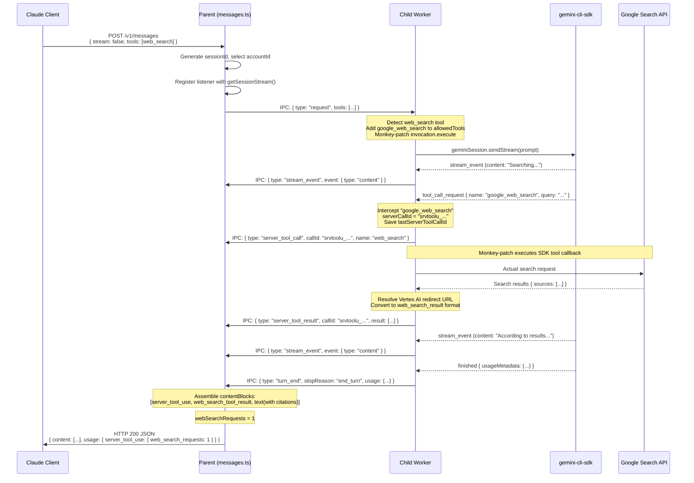
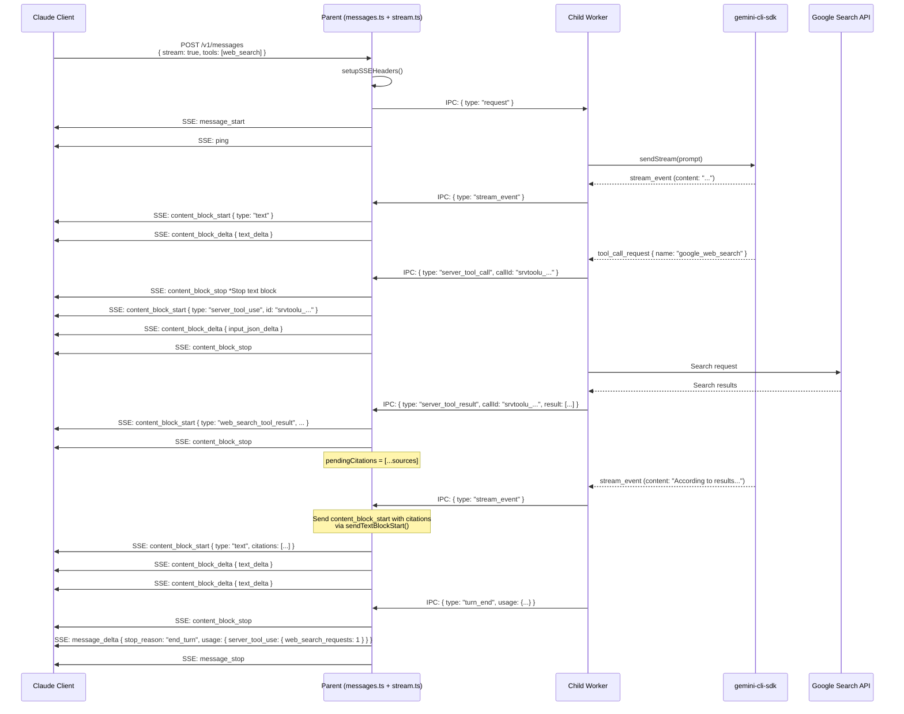
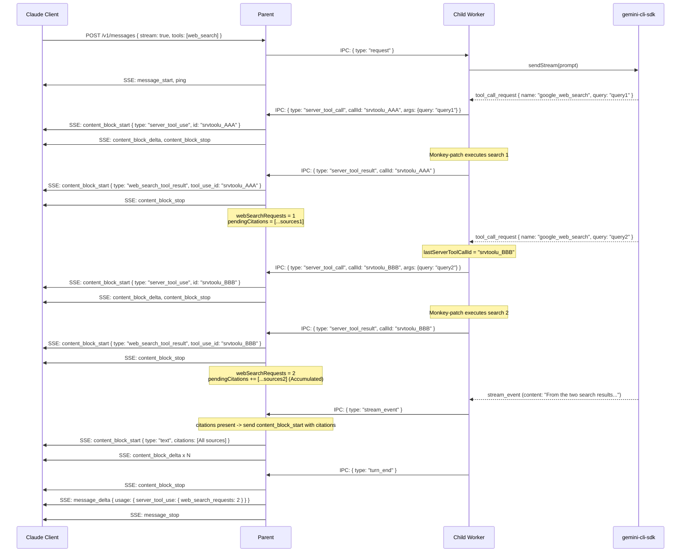
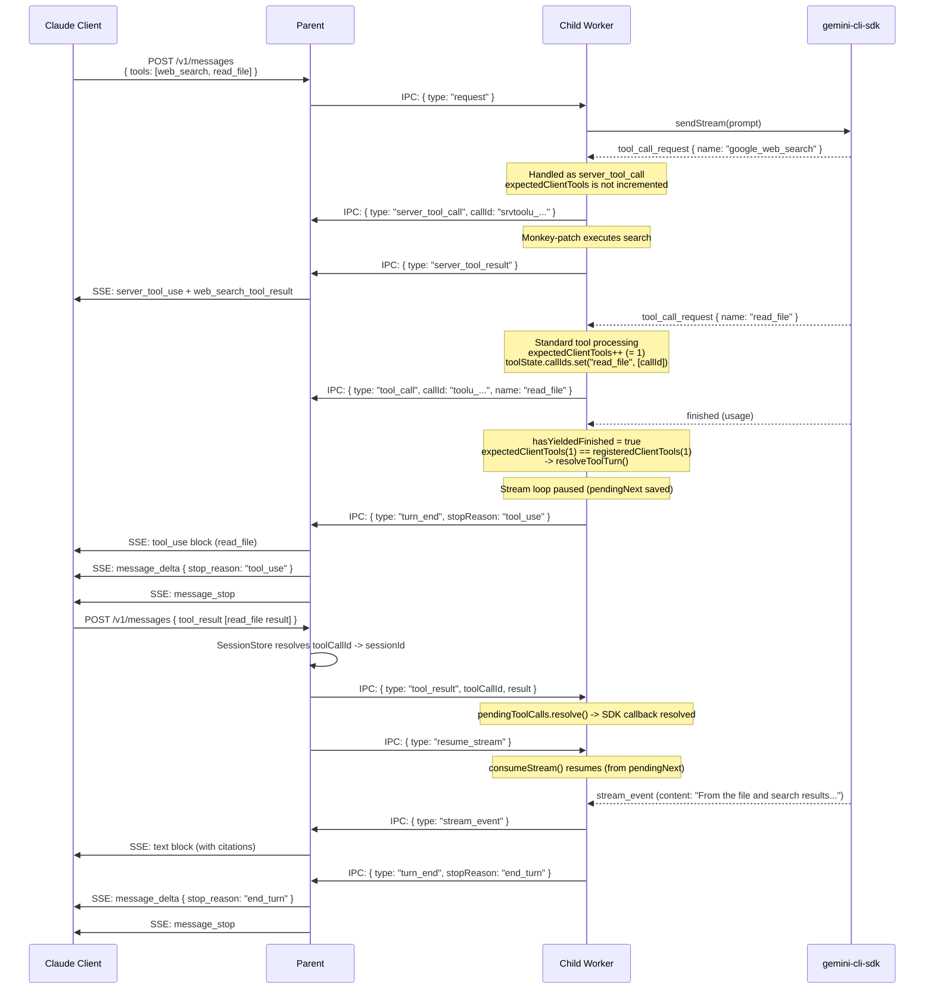
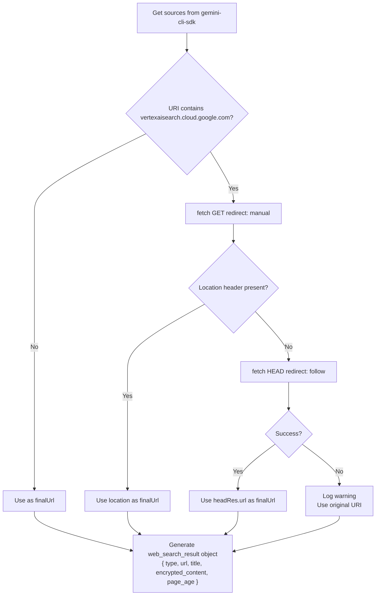

# Web Search Feature Documentation

This feature maps Anthropic's `web_search` server-side tool to gemini-cli's `googleSearch` grounding capability.


## Overview

Claude Code uses a **server-side tool** called `web_search` (a tool that does not require execution on the client-side).
This proxy detects if the client request contains a `web_search` tool definition. If so, it uses the gemini-cli-sdk's `google_web_search` (grounding) feature to perform the actual search and returns the results in a Claude API-compatible format.

### Difference between Claude's `web_search` and standard tools

| Item | Standard Tool (`tool_use`) | web_search (`server_tool_use`) |
|------|------------------------|-------------------------------|
| Execution Entity | **Client** executes and returns `tool_result` | **Server (Proxy)** executes internally |
| Round-trip | Required (Client -> Execution -> Result) | Not required (Completed in a single request) |
| Response Block | `tool_use` block | `server_tool_use` + `web_search_tool_result` blocks |
| usage Field | No change | `usage.server_tool_use.web_search_requests` is added |

---

## Process Flow Overview

```
Claude Client
    │
    │ POST /v1/messages { tools: [{ type: "web_search_20250305", name: "web_search" }] }
    ▼
Parent Process (messages.ts)
    │
    │ IPC: { type: "request", tools: [...] }   ── NDJSON over UNIX Socket ──▶
    ▼
Child Worker (child-worker.ts)
    │
    ├── [First time only] Detect web_search tool
    │       Add google_web_search to allowedTools
    │       Monkey-patch invocation.execute()
    │
    │ sendStream(prompt)
    ▼
gemini-cli-sdk / Google Gemini API
    │
    │ tool_call_request { name: "google_web_search", query: "..." }
    ▼
Child Worker (consumeStream)
    │
    ├── Intercept "google_web_search"
    │       Send server_tool_call IPC
    │       Wait for SDK tool callback (executed by monkey-patch)
    │
    ├── Monkey-patch: Execute actual search
    │       Resolve Vertex AI redirect URLs
    │       Map results to web_search_result format
    │       Send server_tool_result IPC
    │
    │ Continue stream (AI response text)
    │
    │ IPC: turn_end
    ▼
Parent Process
    │
    ├── [Non-stream] Assemble contentBlocks and send JSON response
    └── [Streaming] Send SSE events sequentially
    ▼
Claude Client
```

---

## Implementation Details

### 1. Detecting web_search Tool (`child-worker.ts`)

The `tools` array in the request is inspected. Tools with a `type` starting with `web_search_` are treated as web_search tools.

```typescript
const wsTool = tools?.find(t => t.type?.startsWith('web_search_'));
if (wsTool) {
    claudeWebSearchName = wsTool.name || 'web_search';
    allowedToolNames.push('google_web_search'); // Enable gemini-cli-sdk grounding
}
```

If detected, `google_web_search` is added to `allowedToolNames` to prevent it from being unregistered by `disableBuiltinTools()`.

### 2. Monkey-patching (`child-worker.ts`)

Wraps the `createInvocation` function of the `google_web_search` tool (`registry.getTool('google_web_search')`) to send a `server_tool_result` IPC message after execution.

**Resolving Vertex AI Redirect URLs:**
Search results from the Gemini API may contain intermediate redirect URLs like `vertexaisearch.cloud.google.com/grounding-api-redirect/...`.
The monkey-patch uses `fetch(..., { redirect: 'manual' })` to resolve the final destination URL.

```typescript
// GET redirect: 'manual' to get Location header
const res = await fetch(finalUrl, { method: 'GET', redirect: 'manual' });
const location = res.headers.get('location');
// Fallback: Use HEAD with redirect: follow to get the final URL
```

**Result Format Conversion:**
```typescript
// gemini-cli-sdk sources format
{ web: { uri: string, title: string } }

// -> Result element in IPC server_tool_result (web_search_result format)
{
    type: 'web_search_result',
    url: string,               // Resolved URL
    title: string,
    encrypted_content: string, // Base64 encoded URL (Provisional. Should be encrypted content.)
    page_age: string,          // ⚠️ Gemini does not return publication dates; always sets current date.
                               // new Date().toLocaleDateString('en-US', { month, day, year })
}
```

### 3. Interception in Stream Consumption Loop (`child-worker.ts`)

Inside `consumeStream()`, if `chunk.type === 'tool_call_request'` and `name === 'google_web_search'`, it is handled in a separate branch from standard tools.

```typescript
if (name === 'google_web_search' && wsName) {
    // Generate srvtoolu_ prefixed ID per Claude API standards
    const serverCallId = `srvtoolu_${randomUUID()...}`;
    // Save to sessionData so monkey-patch can use the same ID for results
    (sessionData as any).lastServerToolCallId = serverCallId;
    // Send server_tool_call immediately (no client-side wait)
    sendEvent({ type: 'server_tool_call', ... });
    // google_web_search is a built-in SDK tool; the SDK calls execute() automatically.
    // It is not subject to expectedClientTools (which waits for client tool_result).
    // The monkey-patch simply hooks that execute() to intercept and trigger IPC.
    // -> Do not increment expectedClientTools to skip client-side wait.
}
```

By not incrementing `expectedClientTools`, the stream continues without waiting for a `tool_result` from the client.

### 4. IPC Messages (`ipc-protocol.ts`)

IPC message types added in PR #24:

| Message | Direction | Purpose |
|----------|------|------|
| `server_tool_call` | Child -> Parent | Notify that web_search has started |
| `server_tool_result` | Child -> Parent | Send the result of web_search |

```typescript
// server_tool_call
{ type: 'server_tool_call', sessionId, callId, name, args }

// server_tool_result (Success: Array of search results)
{ type: 'server_tool_result', sessionId, callId, result: WebSearchResult[] }

// server_tool_result (Error: Exception during search execution)
{ type: 'server_tool_result', sessionId, callId,
  result: { type: 'web_search_tool_result_error', error_code: 'internal_error' } }
```

Note that `result` is an object instead of an array in case of an error.

### 5. Parent Process: Response Assembly (`messages.ts` / `stream.ts`)

**General Strategy:**
- Receive `server_tool_call` -> Increment `webSearchRequests` and output `server_tool_use` block.
- Receive `server_tool_result` -> Output `web_search_tool_result` block. Accumulate in `pendingCitations` only if `result` is an **array** (skip on error).
- Receive `turn_end` -> Attach `usage.server_tool_use` if `webSearchRequests > 0`.

```typescript
} else if (msg.type === 'server_tool_call') {
    webSearchRequests++;           // Increment usage counter
    // Output server_tool_use block
} else if (msg.type === 'server_tool_result') {
    // Output result as-is for web_search_tool_result (transparent for errors)
    contentBlocks.push({ type: 'web_search_tool_result', tool_use_id: msg.callId, content: msg.result });

    // Array check: skip citations on error (where result is an object)
    if (Array.isArray(msg.result)) {
        // Accumulate with concat (supports multiple searches)
        pendingCitations = pendingCitations.concat(msg.result);
    }
}
```

### 6. Adding Citations

Source information from search results is attached to subsequent text blocks (Plan A: Bulk attachment).

**Field Name Conversion:**
Inside the IPC, URL Base64 values are held in `encrypted_content`, but the Claude API `web_search_result_location` type expects `encrypted_index`.

```typescript
// Format within IPC server_tool_result
{ type: 'web_search_result', encrypted_content: '<base64>' }

// Conversion when adding to text block citations (messages.ts / stream.ts)
{
    type: 'web_search_result_location',
    url: src.url,
    title: src.title,
    encrypted_index: src.encrypted_content, // <- Field name changes
    cited_text: currentText.slice(0, 150),  // Non-stream: first 150 chars
                                            // Stream: '' (empty string)
}
```

**Non-streaming:** Calls `flushText()` on `turn_end`, performs the above conversion from `pendingCitations`, and attaches it to `block.citations`.  
**Streaming:** Accumulates into `pendingCitations` upon receiving `server_tool_result`. Attaches it to the `content_block.citations` field in the `content_block_start` event when the next text block starts (`sendTextBlockStart()`).

### 7. Error Handling: Search Execution Error (`child-worker.ts`)

If `originalExecute()` in the monkey-patch throws an exception, the `catch` block sends the following error payload.

```typescript
// Success: result is an array of WebSearchResult
{ type: 'server_tool_result', callId, result: [ { type: 'web_search_result', url, title, ... } ] }

// Error: result is an object instead of an array
{ type: 'server_tool_result', callId, result: { type: 'web_search_tool_result_error', error_code: 'internal_error' } }
```

The Parent process (`messages.ts` / `stream.ts`) does not explicitly distinguish between success and error for `server_tool_result`; it transparently passes `result` to the `content` field of the `web_search_tool_result` block (the error object reaches the Claude client directly).

The accumulation into `pendingCitations` is guarded by `if (Array.isArray(msg.result))`, skipping the conversion on error.

---

## Data Flow Sequence Diagrams

### Case 1: Non-streaming (Single web_search)



---

## Case 2: Streaming (Single web_search)



---

### Case 3: Multiple web_search Executions

Cases where the gemini-cli-sdk performs multiple searches within the same turn (e.g., complex queries).



---

### Case 4: Mixing web_search and Standard Tools

Case where the Claude client specifies both `web_search` and a standard tool (e.g., `read_file`).



---

### Case 5: Vertex AI Redirect URL Resolution Flow

URL resolution logic within the monkey-patch.



---

## Responsibilities by Component

| Component | File | Changes in PR #24 |
|--------------|--------|--------------------------|
| **IPC Protocol** | `ipc-protocol.ts` | Added `server_tool_call`, `server_tool_result` types |
| **Child Worker** | `child-worker.ts` | web_search tool detection, monkey-patching, interception in consumeStream |
| **Non-streaming Conversion** | `routes/messages.ts` | Process `server_tool_call` / `server_tool_result`, `webSearchRequests` counter, `pendingCitations` management |
| **Streaming Conversion** | `converters/stream.ts` | Same as above + conversion to SSE, sending `content_block_start` with citations |
| **Type Definitions** | `types.ts` | `ClaudeWebSearchToolResultBlock`, `ClaudeUsage.server_tool_use` |

---

## Constraints and Known Behavior

- **Citation Attachment Method:** Adopts a bulk attachment method (Plan A) where all search result sources are attached to the next text block. Sentence-level mapping is not performed.
- **`encrypted_content` / `encrypted_index`:** Although the Claude API expects encrypted content, this proxy uses Base64 encoded search URLs (implementation constraint). Field names are converted from `encrypted_content` (internal IPC) to `encrypted_index` in Claude API citations.
- **`page_age` is always today's date:** Since the Gemini API does not return publication dates, the monkey-patch uses the execution date (`new Date().toLocaleDateString('en-US', ...)`) as a provisional value.
- **No request round-trip for web_search:** Unlike standard tools, web_search completes within a single HTTP request (no `tool_result` required from the client).
- **⚠️ No Support for Concurrent web_search Execution:** `consumeStream()` processes events serially in a `while(true)` loop, overwriting `lastServerToolCallId` for each `tool_call_request`. If Gemini issues multiple `google_web_search` calls **simultaneously** in a single turn, the calling IDs might be mixed up. The current implementation assumes Gemini issues searches sequentially.
